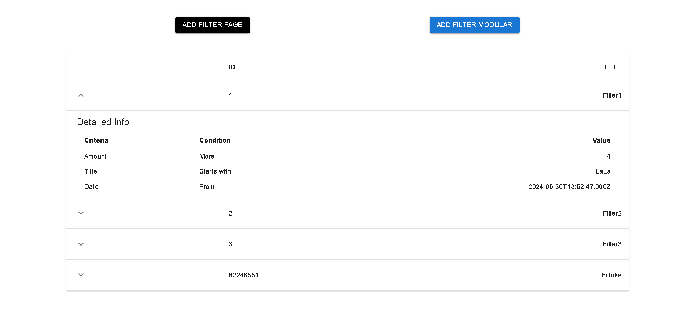
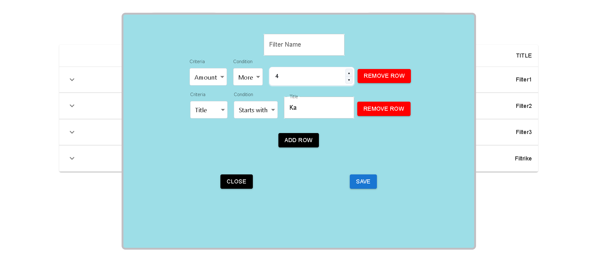
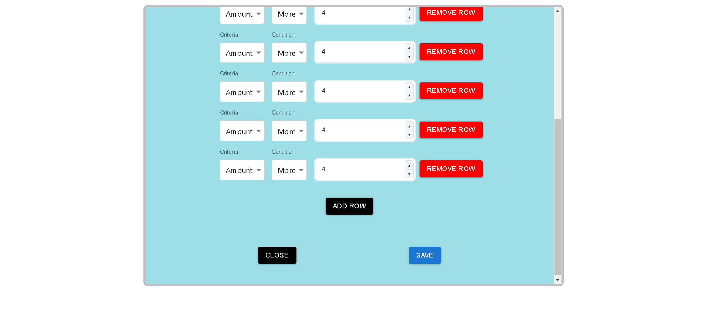

# Building web applications with Java and React/Angular

## Prerequisites

- [IntelliJ IDEA](https://www.jetbrains.com/idea/)
- [NODE](https://nodejs.org/en/download/prebuilt-installer/)

# Project Name: Filters

### Author: Hans-Märten Liiu

 

## Main Idea:

View filters from UI and add filters to database

## Application functional details:

- Modal dialog functional requirements:
- (+) button creates new line of filtering criteria
- (-) button deletes criteria
- Filter should contain at least one criteria
- There can be 3 types of criteria:
- Amount with number comparing conditions
- Title with text comparing conditions
- Date with date comparing conditions, date choice can be represented by date picker or
- 3 combo boxes
- Each added criteria default as “Amount” type
- Comparing conditions should correspond to selected criteria type
  F- ilter dialog should have fixed size and be configurable to operate in modal/non-modal mode
- Let the user resize only the height
- If there are more rows than dialog can fit, scrolling should appear
- In non-modal mode user by clicking “Add Filter” button sees filter dialog as part of page

 

## What can be done next:

- Refactor the code
- Improve on design
   
- Try to Create frontend in Angular to get familiar with that language aswell

 

## How to boot the application:

- For backend, with IntelliJ IDEA you have to open the backend folder and then run the Application.
- For frontend, with CMD you have to move to frontendReact folder and first type npm install to install all packages and after that you can type npm start.

 

## Images of the application

- Home Page
  
- Modular View
  
- Non Modular View
  
